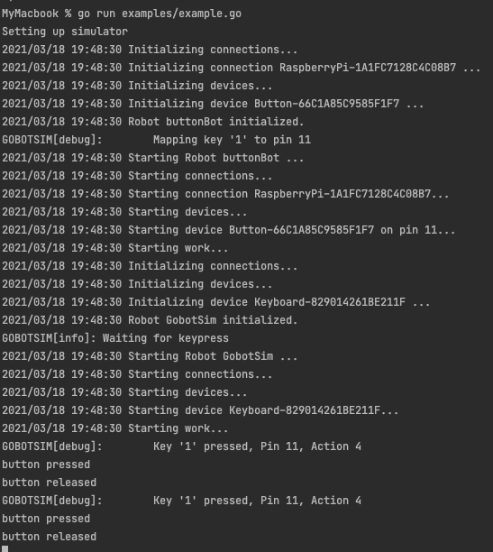

# gobot-sim

**Simulate GPIO pin inputs for [Gobot](https://gobot.io) with your keyboard**  

Gobot-Sim can simulate Raspberry Pi GPIO pin inputs on a local development
machine such as a Mac.
It links specific keyboard input to GPIO inputs captured by GoBot.

It facilitates local development and testing of Gobot applications
on non-raspberry machines.

For example, consider a push button which should be wired to GPIO 11.

With Gobot-sim, you can run your application in the terminal, and
activate the button press by linking it to a keyboard shortcut.

## Example

Run this on your Mac or Linux machine.
You can toggle the button by pressing the '1' key.

```go
package main

import (
	"fmt"
	"github.com/24hoursmedia/gobot_sim"
	"github.com/24hoursmedia/gobot_sim/raspi_sim"
	"gobot.io/x/gobot"
	"gobot.io/x/gobot/drivers/gpio"
	"gobot.io/x/gobot/platforms/raspi"
	"time"
)

func main() {
	fmt.Println("Setting up simulator")

	// set up rasberry pi gobot with a button attached to pin 11 (GPIO17)
	r := raspi.NewAdaptor()
	button := gpio.NewButtonDriver(r, "11", time.Millisecond*100)
	work := func() {
		button.On(gpio.ButtonPush, func(data interface{}) {
			fmt.Println("button pressed")
		})
		button.On(gpio.ButtonRelease, func(data interface{}) {
			fmt.Println("button released")
		})
	}

	robot := gobot.NewRobot("buttonBot",
		[]gobot.Connection{r},
		[]gobot.Device{button},
		work,
	)

	// hook in the simulator. It links keypress '1' to a simulation of a button press and release
	// on pin 11 (GPIO 17)
	sim := raspi_sim.NewGobotSimulator(r)
	sim.Verbosity(gobot_sim.VERBOSITY_VVV)
	sim.MapKeyPressToGPIOAction('1', "11", gobot_sim.PWACTION_BUTTONPRESS)
	sim.EnterSimulationMode()
	go sim.Run()

	// start the 'real' robot
	robot.Start()
}
```


